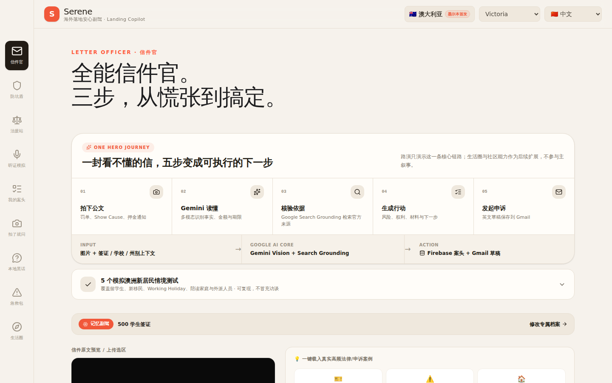

<div align="center">

# Serene ｜ Your Landing Copilot Abroad 🇦🇺🛡️

**Understand the letter you can't read, find out who to contact and what to do next, then get the English appeal letter written.**

`Gemini 3.5 Flash` · `Google Search Grounding` · `Firebase` · `React 19` · `Express`

🏆 Entry for the GDG Going-Global Ideas Challenge · Launching in Melbourne

</div>


---

## What problem does it solve?

Sooner or later, anyone who has just landed in Australia finds an all-English letter in their mailbox: a parking fine, a Show Cause notice from their university, a bond deduction notice, a shockingly high utility bill.

Translation was never the hard part. The hard part is **not knowing what the letter actually wants from you, when the deadline is, whether you have a case, which agency to contact, and how to write an English reply that doesn't hurt your position**. Advice found in community forums is usually years out of date, from a different state, or simply wrong.

Serene compresses that journey into five steps, each backed by a verifiable source:

<div align="center">

| 01 Snap the letter | 02 Gemini reads it | 03 Verify the basis | 04 Plan the action | 05 Appeal |
|:---:|:---:|:---:|:---:|:---:|
| Fines, Show Cause<br>bond notices | Multimodal extraction<br>facts / amounts / deadlines | Google Search<br>official sources | Risks, rights<br>documents & next steps | English draft<br>saved to Gmail |

</div>

Step three is the key: **the answer isn't recalled from the model's memory — it's looked up live**. Choose "Australia / Victoria" and it searches Victoria's current rules, then lists the sources it cited.

---

## Features

### ✍️ Letter Officer — turn a letter into an actionable next step

Snap and upload a fine or warning letter. Gemini Vision extracts the facts, amounts and deadlines, verifies the legal basis online, and generates appeal points plus a ready-to-send English email (opened and pre-filled in Gmail in one click).

Six real, high-frequency sample cases are built in (parking fine / Show Cause / bond deduction / academic plagiarism / noise complaint / overdue utility bill), so you can try the full flow without uploading anything.

**Privacy Redaction Shield**: when enabled, names, student IDs, addresses, reference numbers and similar fields are replaced with `[REDACTED]` in the AI output. The original document is only relayed to Gemini through your own backend — never stored, never cached.

### 🛡️ Scam Shield — don't get ripped off, don't get scammed

- **Smart price check**: is $80 too much for a second-hand microwave? It compares live against new prices at Kmart / IKEA / Target and suggests a fair second-hand range.
- **Work-hours reality check**: converts a price into "how many hours you'd have to work at minimum wage to pay for this".
- **Scam self-check**: tick suspicious signals (claims to be from the embassy / asks for gift-card payment / pressures you to decide right now…) and upload chat screenshots; it rates the risk level against Scamwatch alerts.

### ⚖️ Legal Hub — who to contact, what to do, how to write it

Generated in real time for the state or province you choose: the rights you have by law, the steps in the dispute process, the relevant official agencies and their contact details, and English appeal templates you can use directly. Covers four high-frequency scenarios: rental bonds, traffic fines, wage theft and academic misconduct.

### 🚑 Emergency Kit — when you're panicking, just read it out

- **Interpreter first**: the moment 000 answers, say `"Mandarin Chinese, Please!"` (or your own language) to be connected to Australia's free, 24-hour government telephone interpreting service. This is the single most important sentence in the whole module.
- **English SOS cheat sheet**: bilingual phrases for four situations — sudden illness, robbery, break-in and fire — that can be read aloud or copied.
- **Tenant emergency toolkit**: calm scripts, official channels and legal references for eight kinds of dispute, including a landlord entering without notice, forced eviction, water or power cut off, and bond withholding.

### 🌏 Six display languages



The interface supports **English / 中文 / Español / हिन्दी / Tiếng Việt / العربية**. Formal letters are always in English (they're the ones being sent); what changes is the language things are explained to you in.

> Arabic currently has translated text only; full RTL layout is not yet supported.

---

## How it's built

| Capability | Powered by |
|---|---|
| Image understanding, appeal letter generation | `gemini-3.5-flash` (multimodal) |
| Live verification against official sources | Google Search Grounding, with citations and retrieval time |
| Lightweight text generation | `gemma-4-26b-a4b-it` |
| Text-to-speech | `gemini-3.1-flash-tts-preview` |
| Sign-in / cloud sync | Firebase Auth + Firestore (optional; runs in local mode if not configured) |
| Frontend / backend | React 19 + Vite + Tailwind 4 / Express + tsx |

### API keys never reach the frontend

Every Gemini request is made from the **Express backend**. `GEMINI_API_KEY` lives only in server-side environment variables; the browser never sees it.

### Data isolated per owner

In `firestore.rules`, appeal records (`appeals`), user profiles (`userProfiles`) and to-dos (`kanbanTasks`) are all isolated per UID at a fine-grained level — any read or write from a different UID is denied.

Group meals (`meetups`) is deliberately a no-login collection (friends join by scanning a code), so it is hardened separately: `list` is forbidden (rooms can't be enumerated), `delete` is forbidden (strangers can't wipe an active room), every write validates fields and lengths, and `get` requires the random 6-character room code.

---

## Running locally

### 1. Install dependencies

```bash
npm install
```

Requires Node.js 18+ (20 or 22 recommended).

### 2. Configure your own keys

Copy `.env.example` to `.env` and fill in your own Gemini API key:

```env
GEMINI_API_KEY=your_gemini_api_key_here
GOOGLE_MAPS_PLATFORM_KEY=
```

Get a free `GEMINI_API_KEY` from [Google AI Studio](https://aistudio.google.com/apikey). `GOOGLE_MAPS_PLATFORM_KEY` only affects the map component; leave it empty and the map falls back to a static view, with everything else unaffected.

> `.env` is listed in `.gitignore` and will not be committed.

### 3. (Optional) Connect your own Firebase

Replace the values in `firebase-applet-config.json` with your own Firebase web config to enable Google sign-in and cloud sync:

```json
{
  "projectId": "your-project-id",
  "appId": "your-app-id",
  "apiKey": "your-web-api-key",
  "authDomain": "your-project-id.firebaseapp.com",
  "firestoreDatabaseId": "(default)",
  "storageBucket": "your-project-id.firebasestorage.app",
  "messagingSenderId": "your-sender-id",
  "measurementId": ""
}
```

**It runs without Firebase too**: with the values left empty, the app switches to local mode and keeps all data in the browser's localStorage — you just won't have sign-in or cross-device sync.

Remember to deploy `firestore.rules` to your project, and add HTTP referrer restrictions to this web key in the GCP console.

### 4. Start

```bash
npm run dev
```

Open http://localhost:3000.

### 5. Other commands

```bash
npm run lint    # TypeScript type check
npm test        # Run tests
npm run build   # Production build
npm start       # Run the production build
```

---

## Deployment

### Google Cloud Run

A `Dockerfile` is included and the server listens on `0.0.0.0:$PORT`, so it works with Cloud Run out of the box:

```bash
gcloud run deploy serene --source . --region asia-southeast1 \
  --allow-unauthenticated --set-env-vars GEMINI_API_KEY=<your-key>
```

### Render

`render.yaml` in the project root is ready to go. `GEMINI_API_KEY` is set to `sync: false`; enter it separately in the Render dashboard.

---

## Project structure

```
├── server.ts              # Express backend: all Gemini calls and Search Grounding
├── src/
│   ├── App.tsx            # App shell, header, tab navigation
│   ├── components/        # Feature modules
│   └── lib/
│       ├── i18n.ts        # UI strings for all six languages
│       ├── locale.tsx     # Country / state / display language
│       └── firebase.ts    # Auth + Firestore (degrades gracefully when unconfigured)
├── firestore.rules        # Database security rules
├── firebase-applet-config.json   # Firebase web config — replace with your own
└── docs/screenshots/      # README screenshots
```

---

## Notes

- This project provides **information organisation and document drafting assistance** and does not constitute legal advice. For matters with significant consequences, consult a licensed lawyer or your local free legal aid service.
- The guides, group meals and second-hand marketplace under the "Community" tab are **concept demos** using sample data, with no real money involved. The photo translation and live exchange rates in "Utilities" are real, working Gemini features.
- The organisations in the demo letters (City of Brentmoor, Westhaven University, Horizon Residential, etc.) are all fictional.

---

<div align="center">

*In an unfamiliar southern hemisphere, dodge the pitfalls, weather the storms, and stand your ground.*

</div>
